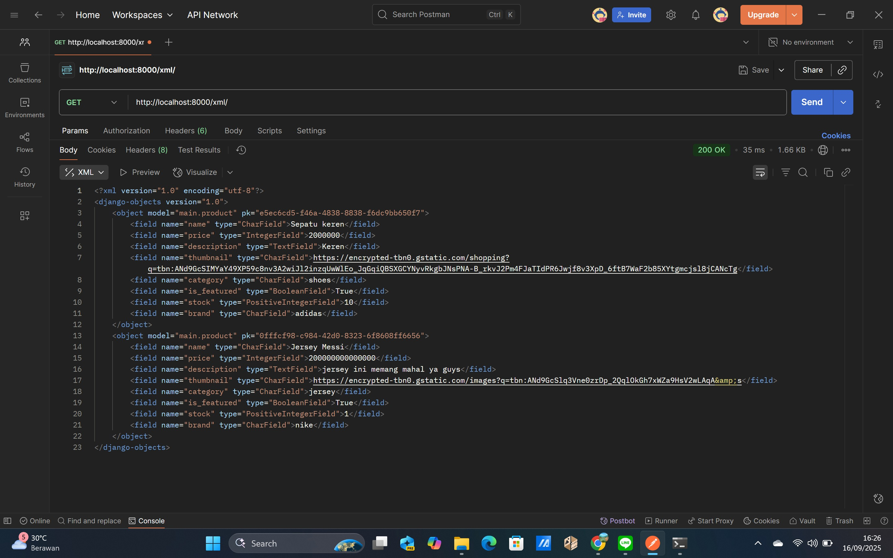
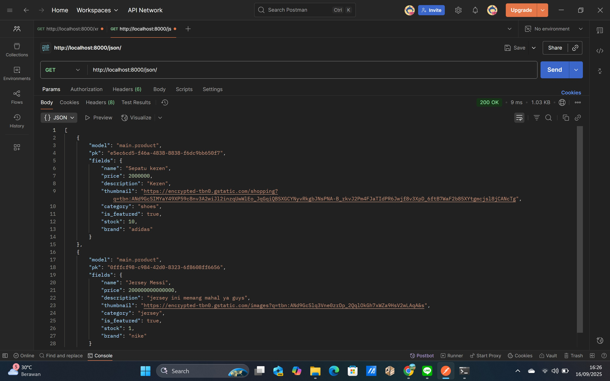
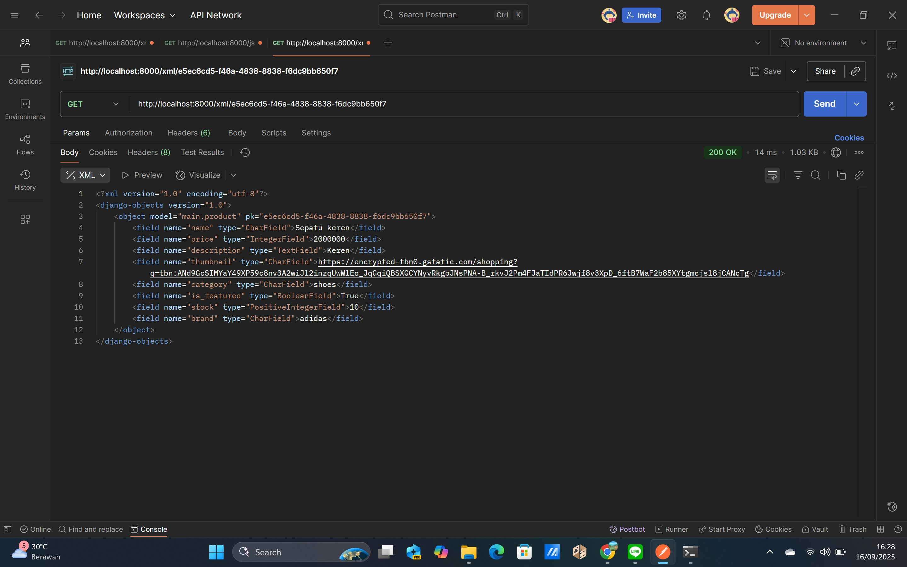
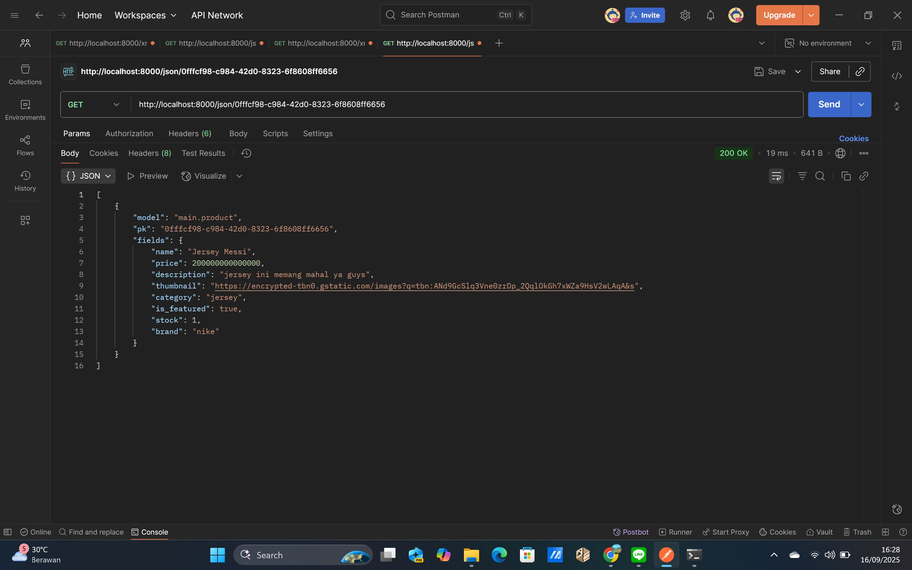
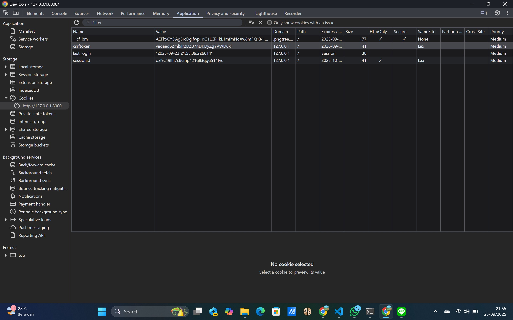

## Link deployment (PWS)
https://levina-aurellia-footballstation.pbp.cs.ui.ac.id

## Deskripsi Football Station
Aplikasi ini adalah tugas PBP (Football Shop) dengan nama aplikasinya yaitu 'Football Station'. Aplikasi ini dibuat menggunakan Django (MVT) dan memenuhi requirement tugas 2 mata kuliah PBP yang antara lain seperti model `Product` memiliki atribut `name`, `price`, `description`, `thumbnail`, `category`, `is_featured` dengan sedikit tambahan atribut sebagai variasi.

---
## Jawab Pertanyaan Tugas 2
<details>
<summary>📘 Tugas 2</summary>

1. Jelaskan bagaimana cara kamu mengimplementasikan checklist di atas secara step-by-step  
[Jawaban]  
Pertama, saya membuat project Django baru dengan perintah django-admin startproject footballstation . di terminal folder football-station, dengan begitu terbentuklah kerangka dasar proyek beserta file manage.py. Setelah itu, saya menambahkan sebuah app bernama main menggunakan python manage.py startapp main, lalu mendaftarkannya ke dalam INSTALLED_APPS di settings.py. Di dalam app main, saya mendesain sebuah model Product yang berisi beberapa field utama seperti name, price, description, thumbnail, category, dan is_featured. Saya juga menambahkan field tambahan stock serta brand dengan choices. Agar perubahan model tersimpan ke database, saya menjalankan python manage.py makemigrations dan python manage.py migrate.  
Selanjutnya, saya membuat fungsi view show_main di views.py yang akan me-render file template main.html. Template ini saya isi dengan informasi sederhana seperti nama aplikasi, nama, dan kelas saya. Routing dilakukan dengan menambahkan path ke urls.py yang ada di dalam main, lalu menghubungkannya dengan urls.py sehingga bisa diakses lewat browser. Setelah itu, saya melakukan testing lokal dengan menjalankan python manage.py runserver. Saat semuanya sudah berjalan baik, saya menyiapkan deployment ke PWS. Untuk itu saya membuat file requirements.txt dengan pip freeze > requirements.txt, memastikan gunicorn sudah termasuk di dalamnya, lalu menambahkan ALLOWED_HOSTS. Saya juga mengubah schema menjadi tugas_individu. Terakhir, saya melakukan git add . lalu git commit, kemudian menjalankan git push pws master dengan credentials PWS yang diberikan. Setelah proses build selesai dan statusnya berubah menjadi Running, aplikasi saya sudah berhasil diakses melalui link PWS.  
  

2. Buatlah bagan yang berisi request client ke web aplikasi berbasis Django beserta responnya dan jelaskan pada bagan tersebut kaitan antara urls.py, views.py, models.py, dan berkas html.  
[Jawaban]  
Berikut adalah bagan yang telah dibuat:   
   
Ringkasan penjelasan tambahan:  
- urls.py untuk menentukan URL mana akan ditangani oleh view mana.
- views.py, berisi fungsi/class yang menangani request, mengambil data dari models, lalu menyiapkan context untuk template.
- models.py untuk mengatur struktur data di database, termasuk query untuk mengambil atau menyimpan data.
- Template HTML,  berisi template tag untuk menampilkan data yang dikirim dari view.
  

3. Jelaskan peran settings.py dalam proyek Django!  
[Jawaban]  
settings.py merupakan pusat konfigurasi proyek Django. Semua pengaturan penting terkait database, template, middleware, security, semuanya dikelola di settings.py ini. Perannya mulai dari BASE_DIR yaitu menyimpan data path dasar proyek. Kemudian, SECRET_KEY untuk keamanan seperti enkripsi token, DEBUG untuk menentukan apakah Django menampilkan pesan error atau tidak. Kemudian, ALLOWED_HOSTS untuk mendaftarkan domain/IP yang boleh mengakses aplikasi. INSTALLED_APPS berisi daftar aplikasi Django custom apps yang aktif, seperti di sini saya menambahkan 'main' ke dalam INSTALLED_APPS. Kemudian, MIDDLEWARE berperan untuk menentukan proses req atau response yang dijalankan Django.   
Dari penjelasan di atas tentang peran masing-masing komponen yang ada pada settings.py, menunjukkan bahwa settings.py tidak hanya berfungsi sebagai kumpulan konfigurasi teknis, tetapi juga sebagai penghubung antarbagian framework Django. Mulai dari keamanan (SECRET_KEY, DEBUG, ALLOWED_HOSTS), aplikasi yang digunakan (INSTALLED_APPS), hingga alur request-response (MIDDLEWARE), semuanya pengaturannya dari file ini. Oleh karena itu, settings.py merupakan pusat yang memastikan setiap komponen dalam proyek Django berjalan sesuai aturan dan kebutuhan yang telah ditentukan.  


4. Bagaimana cara kerja migrasi database di Django?  
[Jawaban]  
Adanya migrasi database pada Django bertujuan untuk menyimpan instruksi segala hal modifikasi skema basis data. Setiap kali terdapat perubahan, menambahkan, atau memodifikasi perlu dipastikan bahwa basis data tersimpan dan sinkron dengan model yang ada pada proyek Django. Maka dari itu, Django menggunakan migrasi inilah untuk tiap kali menerapkan perubahan ke basis data dengan dua perintah, yaitu makemigrations dan migrasi. Berikut cara kerjanya:  
    - Pertama, Django akan memeriksa perubahan pada model dengan membandingkannya terhadap histori migrasi sebelumnya. Setelah itu, Django membuat file migrasi di direktori app/migrations/ berupa file Python yang berisi instruksi perubahan skema database. Nantinya berkas-berkas migrasi akan diberi nomor otomatis sebagai penanda perubahan yang dibuat pada skema basis data.
    - Kedua, setelah file migrasi terbentuk, perintah python manage.py migrate dijalankan untuk menerapkan instruksi tersebut ke database. Django memastikan migrasi dijalankan sesuai urutan yang benar dan menyimpan catatan migrasi yang sudah diterapkan di tabel khusus bernama django_migrations.
    -  Dengan menjalankan perintah tersebut, Django akan melakukan pembaruan pada skema database sehingga selaras dengan modifikasi yang tercatat dalam berkas migrasi.  

  
5. Menurut Anda, dari semua framework yang ada, mengapa framework Django dijadikan permulaan pembelajaran pengembangan perangkat lunak?  
[Jawaban]  
Berdasarkan referensi yang telah saya baca, Django cocok dijadikan pemulaan belajar pengembangan perangkat lunak karena erat kaitannya dengan Python yang banyak orang sudah familiar dengan bahasa pemrograman tersebut, sehingga waktu pengembangan bisa lebih efektif. Selain itu, dokumentasinya lengkap sehingga pemula (seperti saya) mudah mengikuti panduan yang ada. Django juga menggunakan pendekatan 'batteries included' yang artinya menyediakan berbagai fitur penting bawaan seperti ORM sehingga kita tidak perlu membangun semuanya dari nol. Di sisi lain, Django juga memiliki sistem keamanan terintegrasi dan selalu diperbarui, misalnya perlindungan dari XSS, CSRF, dan SQL Injection, tanpa perlu bergantung pada library pihak ketiga yang rentan bug, membuat Django cukup aman dan terpercaya. Framework ini juga fleksibel karena bisa digunakan untuk proyek kecil maupun besar, bahkan hingga level perusahaan seperti Spotify dan Quora, serta mendukung lintas platform dan berbagai basis data. Django juga mengikuti prinsip pemrograman DRY (Don't Repeat Yourself) dan KISS (Keep It Simple and Short) sehingga kode yang dihasilkan lebih rapi, mudah dibaca, dan minim bug. Ditambah lagi, Django memiliki dukungan REST API yang memudahkan pengembang dalam membuat layanan pertukaran data tanpa harus berurusan langsung dengan detail teknis query database. Yang tidak kalah penting, Django juga punya komunitas global yang sangat besar, aktif, dan suportif, sehingga jika ada kesulitan akan mudah menemukan solusi terbaik dari para pengembang berpengalaman. Dengan semua alasan tersebut itulah yang saya rasa mengapa Django dijadikan sebagai framework yang ideal untuk pemula dalam memahami konsep dasar pengembangan perangkat lunak.
  
  
6. Apakah ada feedback untuk asisten dosen tutorial 1 yang telah kamu kerjakan sebelumnya?  
[Jawaban]  
Menurut saya, arahan yang diberikan asdos pada tutorial 1 sangat membantu saya memahami alur pembuatan proyek Django, mulai dari routing hingga bagian-bagian lainnya. Tanpa penjelasan yang asdos sampaikan, baik melalui Discord maupun web tutorial, mungkin saya akan kesulitan menyelesaikan tugas 2 ini. Oleh karena itu, saya rasa tidak ada saran khusus untuk asdos, hanya harapan saya mungkin agar pada sesi lab berikut-berikutnya tetap seperti ini yaitu memberikan penjelasan yang jelas dan lengkap. Terima kasih banyak, kakak asdos!
  
   
Referensi:  
1. https://www.geeksforgeeks.org/python/django-basic-app-model-makemigrations-and-migrate/
2. https://blog.jetbrains.com/pycharm/2023/11/django-vs-flask-which-is-the-best-python-web-framework/
3. https://opensource.com/article/18/8/django-framework
4. https://www.geeksforgeeks.org/blogs/why-django-framework-is-best-for-web-development/
5. https://www.djangoproject.com/start/overview/
</details>

---
## Jawab Pertanyaan Tugas 3
<details>
<summary>📘 Tugas 3</summary>

1. Jelaskan mengapa kita memerlukan data delivery dalam pengimplementasian sebuah platform?  
[Jawaban]  
Pada dasarnya data delivery merupakan cara kita mengirimkan data dari satu bagian sistem ke bagian lain. Formatnya bisa macam-macam, misal HTML, XML, atau JSON. Kalau HTML biasanya dipakai untuk menampilkan data langsung ke pengguna lewat browser, sedangkan XML dan JSON lebih sering dipakai untuk pertukaran data antar aplikasi. 
  
    Maka dari itu, kita perlu data delivery karena dalam pengembangan platform modern, data tidak hanya dipakai oleh satu tampilan saja, melainkan dipakai juga dalam:
- data perlu data untuk ditampilkan ke user
- aplikasi mobile mengambil data yang sama lewat API
- layanan pihak ketiga/ integrasi (c/. dashboard analitik) perlu pula mengakses data itu
- testing dan automasi lebih mudah dilakukan kalau ada akses ke data mentahnya.  
    Dengan adanya data delivery (terutama format XML atau JSON), backend bisa menyediakan data yang terpisah dari tampilan, sehingga lebih fleksibel, bisa dipakai berulang bagi frontend, dan membuat sistem lebih modular.  
   
   
2. Menurutmu, mana yang lebih baik antara XML dan JSON? Mengapa JSON lebih populer dibandingkan XML?  
[Jawaban]  
XML maupun JSON bisa dipakai untuk menyimpan dan bertukar data. XML memiliki kelebihan untuk kebutuhan dokumen yang kompleks karena mendukung metadata, namespace, dan transformasi seperti XSLT. Namun, cara aksesnya lah yang bisa dibilang lebih ribet, perlu parsing dengan XML DOM lalu looping elemen satu per satu. Sedangkan JSON lebih sederhana. Data disusun dengan format objek/array sehingga mudah dibaca, ditulis, dan diproses. Bahkan di JavaScript saat menerima JSON bisa langsung melakukan JSON.parse() dan data bisa langsung dipakai.  
    
    Jadi, kalau diberi pilihan mana yang lebih baik, saya menjawabnya tergantung. XML lebih baik untuk dokumen yang kompleks dengan kebutuhan metadata, JSON lebih baik untuk API modern terutama web dan mobile, karena lebih ringan, mudah, dan cepat.
  
    Dan JSON lebih popular karena kebanyakan aplikasi sekarang butuh API yang cepat, efisien, dan mudah diintegrasikan dengan JavaScript atau bahasa pemrograman lain.
   
   
3. Jelaskan fungsi dari method is_valid() pada form Django dan mengapa kita membutuhkan method tersebut.   
[Jawaban]  
Method is_valid() pada form Django dipakai untuk melakukan validasi data yang dikirimkan lewat form. Ketika kita membuat instance form dan mengisinya dengan data (biasanya dari request.POST), kita perlu memanggil form.is_valid() supaya Django bisa mengecek apakah data tersebut memenuhi semua aturan validasi yang berlaku.   
   
    Proses validasi ini bukan hanya sekadar ngecek tipe data dasar (misalnya angka atau teks), tapi lebih dalam lagi:  
- Django akan membersihkan data melalui mekanisme `full_clean()`, sehingga setiap field punya data yang sudah sesuai format.
- Django juga menjalankan validator bawaan maupun custom (misalnya cek panjang minimal password).
- Kalau form tersebut berbasis ModelForm, Django ikut memanggil `validate_unique()` untuk memastikan field yang diberi atribut `unique=True` tidak duplikat di database.
- Semua error yang ditemukan tidak langsung menghentikan proses, tapi dikumpulkan di `form.errors`.
   
    Hanya setelah semua tahap validasi ini lolos, form.is_valid() akan mengembalikan True. Kalau ada yang gagal, ia mengembalikan False dan kita bisa kasih feedback yang sesuai di template.   
    
    Alasan mengapa kita butuh is_valid() adalah karena Django sudah menyediakan satu mekanisme validasi yang lengkap, reusable, dan aman. Kalau kita mencoba bikin validasi sendiri langsung di view, biasanya hasilnya lebih ribet, gampang ada bug, dan sulit dipakai ulang. Dengan is_valid(), kita bisa yakin data yang masuk sudah dicek dari banyak sisi (tipe data, format, constraint unik, dsb.) sebelum diproses lebih lanjut seperti disimpan ke database.   

    
   
4. Mengapa kita membutuhkan csrf_token saat membuat form di Django? Apa yang dapat terjadi jika kita tidak menambahkan csrf_token pada form Django? Bagaimana hal tersebut dapat dimanfaatkan oleh penyerang?  
[Jawaban]  
csrf_token dipakai untuk melindungi aplikasi web dari serangan Cross-Site Request Forgery (CSRF). Serangan CSRF terjadi ketika penyerang mencoba menggunakan sesi login pengguna yang masih aktif. Misalnya, pengguna sedang login ke aplikasi bank online, lalu penyerang mengirimkan link atau form tersembunyi yang jika diklik akan mengirim request transfer dana. Karena browser pengguna otomatis menyertakan cookie sesi (yang valid), request itu bisa dieksekusi seolah-olah datang dari pengguna asli.

   Agar hal ini tidak terjadi, Django menyertakan token CSRF, yaitu string unik yang dihasilkan untuk setiap sesi pengguna. Token ini harus ikut dikirimkan bersama setiap request yang sifatnya mengubah data (POST, PUT, DELETE). Django kemudian akan mencocokkan token tersebut dengan yang tersimpan di server.
- Jika token cocok → request dianggap valid.
- Jika token tidak ada atau berbeda → request langsung ditolak (403 Forbidden).

   Kalau kita tidak menambahkan csrf_token di dalam form, maka Django tidak bisa memverifikasi apakah request benar-benar dibuat oleh user yang sah atau hasil manipulasi pihak luar. Dapat berakibat seperti Form bisa dipalsukan oleh penyerang dan “diselundupkan” lewat link atau script berbahaya, bahkan penyerang bisa memanfaatkan sesi login aktif untuk melakukan aksi berbahaya (misalnya ubah password, kirim pesan spam, transfer dana, dsb.) tanpa sepengetahuan user.
   
  Jadi, csrf_token itu semacam pelindung yang memastikan kalau request memang berasal dari user yang sedang membuka form di aplikasi kita, bukan dari sumber luar yang berbahaya.

5. Jelaskan bagaimana cara kamu mengimplementasikan checklist di atas secara step-by-step (bukan hanya sekadar mengikuti tutorial).  
[Jawaban]  
Pertama, saya membuat direktori baru bernama templates di root folder proyek dan menambahkan file base.html sesuai dengan kode yang ada di tutorial 2. Setelah itu, saya menambahkan direktori templates tersebut ke dalam variabel TEMPLATES yang terdapat di settings.py pada direktori proyek football_station.
   
    Kemudian, saya mengubah berkas main.html yang ada di main/templates dengan kode yang disesuaikan dari tutorial 2. Saya juga membuat file baru bernama forms.py di direktori main, isinya sesuai dengan definisi form yang sudah ditentukan. Setelah itu, di views.py pada direktori main, saya menambahkan fungsi untuk tombol add_product dan juga fungsi untuk tombol detail_product.
    
    Selanjutnya, di urls.py pada direktori main, saya mengimpor fungsi-fungsi yang sudah dibuat tadi dan menambahkan path URL baru ke dalam variabel urlpatterns. Setelah itu, saya mengubah isi main.html serta membuat file add_product.html dan detail_product.html di main/templates untuk menampilkan form penambahan produk dan detail data dari setiap objek model.
    
    Berikutnya, saya menambahkan konfigurasi CSRF_TRUSTED_ORIGINS di settings.py pada direktori root proyek. Lalu, di views.py saya membuat empat fungsi tambahan untuk kebutuhan data delivery. Setelah fungsi tersebut selesai dibuat, saya mengimpornya ke dalam urls.py di direktori main dan menambahkan path baru ke dalam urlpatterns.
    
    Terakhir, karena saya menambahkan field UUID pada models.py, saya melakukan makemigrations terlebih dahulu, kemudian menjalankan runserver untuk memastikan proyek berjalan lancar. Setelah semuanya selesai, saya melakukan push proyek ke GitHub serta mengunggahnya ke PWS.
    
6. Apakah ada feedback untuk asdos di tutorial 2 yang sudah kalian kerjakan?   
[Jawaban]  
Menurut saya, tutorial 2 berjalan aman dan terkendali, kak Asdos juga sangat membantu dalam menjelaskan materi serta membimbing langkah-langkah pengerjaan, terima kasih kak.
   
Referensi:  
1. https://www.geeksforgeeks.org/html/difference-between-json-and-xml/
2. https://docs.djangoproject.com/en/5.2/ref/forms/api/
3. https://stackoverflow.com/questions/73173747/django-form-is-valid-what-does-it-check
4. https://www.geeksforgeeks.org/python/csrf-token-in-django/
    
## Screenshoot Postman
XML:   
    
   
JSON:   
   
    
XML by ID:   
    
    
JSON by ID:   
    
</details>

---
## Jawab Pertanyaan Tugas 4
<details>
<summary>📘 Tugas 4</summary>

1. Apa itu Django `AuthenticationForm`? Jelaskan juga kelebihan dan kekurangannya. 
[Jawaban]  
AuthenticationForm adalah formulir bawaan dari modul autentikasi Django `django.contrib.auth.forms` yang dirancang untuk menangani proses login user. Form ini terdapat dua field dasar: username dan password, lalu memvalidasi kredensial yang dimasukkan terhadap sistem autentikasi Django.   

    Cara kerjanya:    
    Validasi input --> Autentikasi --> Login --> Sesi   
    Pada tahap validasi input merupakan tahap pengecekan apakah username dan password yang dimasukkan sudah sesuai format dan terdaftar. Setelah itu, memanggil fungsi django.contrib.auth.authenticate() untuk mencocokan kredensial. Jika valid, pengguna akan diautentikasi, lalu Django membuat session seingga pengguna tetap login selama berada di aplikasi.

    Kelebihan:
    - Keamanan terjamin karena menggunakan sistem autentikasi Django
    - Cepat dan efisien, tidak perli lagi tulis ulang kode login sehingga mempercepat pengembangan terutama aplikasi besar.
    - Terintegrasi penuh, bekerja dengan sangat baik dengan komponen autentikasi bawaan Django seperti login_required, tampilan login, sistem manajemen sesi.
    - Mudah digunakan dan di-custome. Mudah digunakan karena dengan hanya meng-import dan menggunakannya di view. Sedangkan, mudah di-custome karena dapat di-subclass untuk menambahkan field atau logika tambahan.

    Kekurangan:
    - Kurang fleksibel untuk kebutuhan yang unik. Hal ini karena hanya mendukung flow login standar seperti username dan password. Apabila ingin login pakai email.OTP perlu cutom form lebih lanjut.
    - Terlalu kompleks untuk proyek sederhana. Untuk proyek kecil terkadang tidak butuh sistem auth penuh melainkan hanya sekadar halaman statis atau autentikasi sederhana berbasis token/manual
    - Bergantung pada model user bawaan yang defaultnya untuk model user Django standar, sehingga perlu penyesuaian ketika ingin custome user model.
    - Untuk yang  baru terjun dan belajar sistem Django, terkadang sistem form dan auth butuh pemahaman mendalam dan cukup lama.
   
   
2. Apa perbedaan antara autentikasi dan otorisasi? Bagaiamana Django mengimplementasikan kedua konsep tersebut?
[Jawaban]  
Perbedaan utama terletak pada identitas dan aksesnya. Autentikasi yaitu proses untuk memverifikasi identitas suatu pengguna, sebagai contoh pengguna memasukkan username dan password untuk login, kemudian jika data cocok, sistem akan memastikan bahwa pengguna tersebut valid. Otorisasi yaitu proses untuk menetukan hak akses pengguna setelah terautentikasi, contohnya seorang admin bisa mengakses halaman dashboard suatu aplikasi/website manajemen, sedangkan pengguna biasa tidak bisa.  

    Implementasi di Django:
    Di Django, autentikasi ditangani oleh framework django.contrib.auth. Proses ini mencakup verifikasi kredensial menggunakan fungsi authenticate(), dan saat berhasil, pengguna akan dibuatkan session dengan fungsi login() sehingga tetap terhubung saat menjelajah aplikasi. Django juga menyediakan form bawaan seperti AuthenticationForm yang sudah dibahas juga pada soal nomor satu, yang digunakan untuk mempermudah implementasi login. Sementara itu, otorisasi di Django melalui sistem permission dan group. Field seperti is_authenticated, is_staff, dan is_superuser membantu membedakan level akses pengguna, sedangkan permission berbasis model (misalnya add, change, delete) memungkinkan kontrol akses yang detail. Untuk penerapannya sendiri, Django menyediakan decorators seperti @login_required agar hanya pengguna yang sudah login bisa mengakses suatu view, serta @permission_required('app_label.permission_name') untuk membatasi akses berdasarkan izin tertentu.
   
3.  Apa saja kelebihan dan kekurangan session dan cookies dalam konteks menyimpan state di aplikasi web?  
[Jawaban]  
Session dan cookies sama-sama dipakai untuk menyimpan state pada aplikasi web, tapi keduanya punya kelebihan dan kekurangan masing-masing. Cookies disimpan langsung di browser pengguna sehingga ringan di server dan mudah digunakan untuk menyimpan preferensi sederhana seperti bahasa atau tema. Namun, karena tersimpan di sisi klien, cookies rentan dimanipulasi dan biasanya memiliki batas ukuran yang kecil (sekitar 4KB). Sebaliknya, session disimpan di sisi server sehingga lebih aman untuk data sensitif, misalnya informasi login. Browser hanya menyimpan session ID dalam cookie sebagai kunci untuk mengambil data di server. Kekurangannya, session membebani server karena harus menyimpan data untuk banyak pengguna sekaligus dan juga biasanya memiliki masa berlaku terbatas. Dengan begitu, cookies bisa dibilang lebih cocok untuk penyimpanan ringan di sisi klien, sedangkan session lebih cocok untuk data penting yang butuh keamanan lebih tinggi.

   
4. Apakah penggunaan cookies aman secara default dalam pengembangan web, atau apakah ada risiko potensial yang harus diwaspadai? Bagaimana Django menangani hal tersebut? 
[Jawaban]  
Penggunaan cookies tidak sepenuhnya aman secara default karena ada sejumlah risiko potensial, seperti pencurian cookies melalui serangan Cross-Site Scripting (XSS) atau penyalahgunaan cookies dalam Cross-Site Request Forgery (CSRF). Cookies juga dapat diubah secara manual oleh pengguna di sisi klien. Oleh karena itu, penting bagi pengembang untuk membatasi akses cookies hanya untuk keperluan yang aman. Django sudah menyediakan beberapa mekanisme untuk meminimalisasi risiko ini, misalnya, cookie session secara default ditandai dengan atribut HttpOnly sehingga tidak dapat diakses oleh JavaScript, serta bisa diatur dengan Secure agar hanya dikirim melalui HTTPS. Selain itu, Django otomatis menggunakan CSRF token untuk mencegah serangan CSRF, dan mendukung konfigurasi seperti `SESSION_COOKIE_SECURE`, `SESSION_COOKIE_HTTPONLY`, serta `CSRF_COOKIE_SECURE` yang dapat diaktifkan untuk meningkatkan keamanan. Dengan penanganan inilah Django membantu menjaga agar penggunaan cookies lebih aman, meskipun pengembang tetap perlu mengonfigurasi setting dengan benar sesuai kebutuhan aplikasi.

5. Jelaskan bagaimana cara kamu mengimplementasikan checklist di atas secara step-by-step (bukan hanya sekadar mengikuti tutorial).
[Jawaban]  
- Pertama, saya bikin fungsi register di views.py dengan UserCreationForm dan messages, terus saya tambahin template register.html buat form-nya.
- Lanjut ke login, saya bikin fungsi pakai AuthenticationForm, authenticate, sama login. Di bagian ini saya juga nyimpen cookie last_login kalau login berhasil, dan saya bikin login.html buat form login.
- Untuk logout, saya bikin fungsi dengan logout() yang sekalian ngapus cookie last_login. Tombol logout saya taruh di main.html
- Semua fungsi itu saya daftarin di urls.py biar bisa diakses lewat path masing-masing.
- Supaya lebih aman, saya kasih decorator `@login_required di view kayak show_main, add_product, sama product_detail, jadi cuma user yang login yang bisa akses.
- Di fungsi login tadi saya tambahin kode buat nyimpen cookie last_login, terus saya tampilin waktunya di main.html. Pas logout, cookie itu saya hapus lagi.
- Di models.py, saya hubungin Product sama User pakai field ForeignKey.
- Terakhir, saya ubah show_main dan main.html biar bisa nampilin username user yang lagi login, dan saya juga nampilin author di product_detail.html.
- Setelah semua beres, saya coba runserver dan cek di developer tools buat ngecek last_login, csrftoken, sama sessionid. Berikut tampilannya:
 

Referensi:  
1. https://www.geeksforgeeks.org/computer-networks/difference-between-authentication-and-authorization/
2. https://docs.djangoproject.com/en/5.2/topics/auth/
3. https://developer.mozilla.org/en-US/docs/Web/HTTP/Guides/Cookies
4. https://developer.mozilla.org/en-US/docs/Web/HTTP/Guides/Cookies#restrict_access_to_cookies
      
</details>

---
## Jawab Pertanyaan Tugas 5
<details>
<summary>📘 Tugas 5</summary>

1. Jika terdapat beberapa CSS selector untuk suatu elemen HTML, jelaskan urutan prioritas pengambilan CSS selector tersebut!     
`[Jawaban]`    
     
    1) Aturan dengan !important: Selalu dianggap paling kuat. Jadi walaupun ada aturan lain dengan selector yang lebih spesifik, kalau properti sudah diberi !important, maka itu yang dipakai.        
    2) Inline style: CSS yang ditulis langsung di dalam atribut elemen HTML `(<p style="color:red;">)` memiliki prioritas tinggi setelah !important.     
    3) ID selector: Selector yang menggunakan #id lebih tinggi prioritasnya daripada class, attribute, atau element biasa. Misalnya #judul { ... }.     
    4) Class, attribute, dan pseudo-class selector: Selector seperti .kelas, [type="text"], atau :hover berada di bawah ID.        
    5) Element dan pseudo-element selector: Selector langsung nge-tag seperti div, p, atau pseudo-element seperti ::before, ::after adalah yang paling rendah prioritasnya.
    6) Urutan penulisan: Jika tingkat prioritasnya sama, maka aturan yang ditulis paling akhir di stylesheet yang akan dipakai (prinsip cascade: the last rule wins).     

    Jadi dapat disimpulkan urutannya adalah
    `!important > Inline style > ID selector > Class/Attribute/Pseudo-class selector > Element/Pseudo-element selector > Aturan terakhir yang ditulis`      


2. Mengapa responsive design menjadi konsep yang penting dalam pengembangan aplikasi web? Berikan contoh aplikasi yang sudah dan belum menerapkan responsive design, serta jelaskan mengapa!     
`[Jawaban]`      
Responsive design penting karena mayoritas pengguna sekarang mengakses web lewat perangkat mobile. Tanpa desain yang responsive, tampilan di layar kecil jadi tidak nyaman sehingga teks susah dibaca, tombol sulit ditekan, dan pengguna harus zoom in–out. Dengan desain responsive, website otomatis menyesuaikan ukuran layar sehingga pengalaman pengguna lebih baik.  

    Untuk contoh aplikasi yang sudah menerapkan responsive design yaitu Tokopedia. Saat dibuka di desktop maupun smartphone, tata letak produk, menu, dan tombol tetap rapi. Grid produk otomatis menyesuaikan lebar layar, sehingga pengguna bisa berbelanja dengan nyaman di semua perangkat. Kemudian, untuk contoh aplikaso yang belum menerapkan responsive design adalah website sekolah lama atau instansi pemerintah versi lama. Banyak yang masih memakai layout berbasis tabel dengan lebar tetap. Saat dibuka di smartphone, tampilan jadi mengecil, teks sulit dibaca, dan pengguna harus zoom in–out.     


3. Jelaskan perbedaan antara margin, border, dan padding, serta cara untuk mengimplementasikan ketiga hal tersebut!         
`[Jawaban]`    
    Dalam CSS Box Model, setiap elemen memiliki tiga lapisan utama di luar konten, berikut penjelasannya:       
    1) Margin merupakan ruang di luar elemen yang berfungsi memberi jarak antar elemen. Tidak terlihat, hanya menambah spasi di luar border.
        Implementasinya:
        ```css
        div {
            margin: 20px; /* memberi jarak 20px antara elemen ini dengan elemen lain */
        }

    2) Border merupakan garis batas di sekitar elemen yang memisahkan konten dan padding dari margin. Bisa diatur warna, ketebalan, dan jenis garisnya.     
        Implementasinya:
        ```css
        div {
            border: 2px solid black; /* membuat garis hitam setebal 2px */
        }

    3) Padding merupakan ruang di dalam elemen, antara konten (misalnya teks/gambar) dengan border. Jadi, saat membuat konten tidak menempel langsung ke border.     
        Implementasinya:
        ```css
        div {
            padding: 15px; /* memberi jarak 15px antara teks dengan garis border */
        }

    Kemudian jika digabung dalam satu elemen, akan seperti ini:
    ```css
    div {
    margin: 20px;              /* jarak luar */
    border: 2px solid black;   /* garis batas */
    padding: 15px;             /* jarak dalam */
    }

Cara menuliskannya bisa menggunakan inline CSS (`style="..."`), internal CSS (dalam tag `<style>`), atau external CSS (file `.css` terpisah). Namun, dalam implementasinya biasanya digunakan external CSS agar lebih rapi dan mudah dikelola.      

Jadi, margin mengatur jarak antar elemen, border adalah garis pembatas, dan padding mengatur jarak dalam sebelum konten menyentuh border.      


4. Jelaskan konsep flex box dan grid layout beserta kegunaannya!     
`[Jawaban]`      
`Flexbox` adalah sistem layout satu dimensi di CSS3 yang digunakan untuk mengatur elemen secara rapi dalam baris (row) atau kolom (column). Elemen dalam flex container bisa otomatis menyesuaikan ukuran, posisi, dan ruang kosong. Kegunaannya antara lain, mempermudah penyusunan elemen horizontal atau vertikal, mempermudah align (rata kiri, kanan, tengah) dan distribusi ruang antar elemen, serta cocok untuk menu navigasi, tombol sejajar, atau daftar produk dalam satu baris. Contoh implementasi:
    ```css
    .container {
        display: flex;
        justify-content: space-between; /* sebar rata */
        align-items: center;           /* sejajarkan vertikal */
    }
    ```      
                      
    `Grid` adalah sistem layout dua dimensi di CSS3 yang bisa mengatur elemen dalam baris dan kolom sekaligus. Kita bisa membuat struktur layout halaman yang kompleks dengan lebih mudah. Kegunaanya yaitu lebih fleksibel dalam membagi proporsi kolom/baris dan cocok untuk layout besar seperti dashboard, galeri, atau halaman web yang butuh pembagian area jelas. Implementasinya:
    ```css
    .container {
        display: grid;
        grid-template-columns: 1fr 2fr 1fr; /* 3 kolom: kecil - besar - kecil */
        gap: 10px; /* jarak antar elemen */
    }
    ```

    Sehingga dapat disimpulkan perbandingan atau perbedaannya yaitu Flexbox fokus pada satu dimensi (baris atau kolom), sedangkan Grid bekerja pada dua dimensi (baris dan kolom).


5. Jelaskan bagaimana cara kamu mengimplementasikan checklist di atas secara step-by-step (bukan hanya sekadar mengikuti tutorial)!     
`[Jawaban]`     
- Pertama, aku masukin Tailwind ke project dengan cara nambahin `<meta name="viewport">` sama script CDN Tailwind ke base.html. Jadi semua template bisa langsung pakai class-class bawaan Tailwind.
- Terus aku bikin fitur edit dan delete di views.py. Untuk edit, aku bikin fungsi `edit_news` dengan parameter request dan id, pakai `NewsForm` biar bisa ubah data. Sedangkan buat delete, aku bikin fungsi `delete_news` yang ambil objek news sesuai id lalu langsung dihapus.
- Kedua fungsi itu aku daftarin ke urls.py supaya bisa diakses lewat path `/edit` sama `/delete`.
- Di main.html, aku tambahin tombol Edit dan Delete di setiap card berita, tapi tombol itu cuma muncul kalau user yang login sama dengan author dari berita. Jadi nggak semua orang bisa ubah atau hapus berita sembarangan.
- Setelah itu aku bikin navbar.html sebagai komponen terpisah. Navbar ini aku include di main.html supaya tampil di semua halaman. Aku kasih Tailwind biar lebih rapi dan responsif, ada menu untuk login, register, atau logout sesuai kondisi user.
- Aku juga bikin file global.css di folder static/css buat custom styling tambahan, terutama untuk form. File ini aku hubungkan ke base.html, jadi semua form bisa otomatis pakai style yang lebih konsisten.
- Login dan register page aku ubah biar lebih modern pakai kombinasi Tailwind dan global.css, termasuk styling buat error messages, input focus, dan tombol.
- Di halaman home, aku bikin card khusus untuk berita dengan file card_news.html. Kalau news kosong, aku tampilkan gambar `no-news.png` biar halaman tidak kosong.
- Terakhir, bagian yang aku modifikasi sendiri ada di card_product.html. Kalau di tutorial aslinya cuma ada card_news untuk berita, aku bikin card_product buat nampilin produk. Bedanya, di sini aku tambahin badge stock (In Stock, Low Stock, Out of Stock) dengan warna berbeda sesuai kondisi stok, terus aku juga kasih efek hover (shadow hijau + scale gambar). Selain itu, aku taruh info tambahan kayak kategori produk, brand, harga di pojok atas, dan nama user yang nambahin produk di bagian bawah. Tombol Edit/Delete juga aku bikin pakai ikon SVG biar lebih clean.
- Setelah semua selesai, aku jalanin server Django, terus aku tes tiap fitur: create, edit, delete, login, register, dan juga tampilan card. Semuanya jalan sesuai rencana, dan modifikasi card_product bikin tampilan produk lebih interaktif dibanding card_news bawaan tutorial.

Referensi:  
1. https://www.duniailkom.com/tutorial-belajar-css-urutan-prioritas-selector-css-specificity/
2. https://www.duniailkom.com/tutorial-belajar-css-urutan-prioritas-selector-css-cascading/#google_vignette
3. https://developer.mozilla.org/en-US/docs/Web/CSS/CSS_flexible_box_layout/Basic_concepts_of_flexbox
4. https://developer.mozilla.org/en-US/docs/Web/CSS/CSS_grid_layout
      
</details>


---
## Jawab Pertanyaan Tugas 6
<details>
<summary>📘 Tugas 6</summary>

1. Apa perbedaan antara synchronous request dan asynchronous request?  
`[Jawaban]`    
- Synchronous request (sinkron) berarti pengirim permintaan menunggu hingga permintaan itu selesai (mendapat respons) sebelum melanjutkan ke langkah berikutnya. Artinya eksekusi “terhenti” sementara menunggu jawaban.
- Asynchronous request (asinkron) berarti pengirim dapat “mengirim permintaan” lalu langsung melanjutkan ke tugas lain, dan nanti “callback” atau mekanisme lain akan menangani respons ketika sudah datang.

    Contoh konkret di browser: kalau kamu melakukan `XMLHttpRequest` dengan `async = false`, maka browser akan “membeku” sampai respons datang. Sedangkan jika `async = true`, browser tetap dapat merespons interaksi pengguna (klik, scroll, dll) sembari menunggu respons.   
    Jadi perbedaan utamanya adalah blocking dan non-blocking serta urutan eksekusi langsung dan menunggu respons nanti.


2. Bagaimana AJAX bekerja di Django (alur request–response)?    
`[Jawaban]`      
    1) Client side (Browser / JavaScript)
        - Halaman HTML/JS sudah di-load ke browser.
        - JavaScript (bisa menggunakan XMLHttpRequest, fetch(), atau library seperti jQuery) membuat permintaan HTTP ke endpoint Django (URL tertentu).
        - Permintaan nya bisa metode GET, POST, dsb. Jika POST, perlu juga menyertakan header/field CSRF token agar Django tidak menolak permintaan. 
        - JavaScript bisa mengirim data (JSON, form data, dsb) ke server lewat body permintaan atau lewat query parameter (GET).
    2) Server side (Django)
        - URL yang dituju akan dipetakan ke view Django (lewat urls.py).
        - View tersebut akan menerima request (misalnya request.GET atau request.POST), memproses logika (validasi, kueri database, dsb).
        - View kemudian menghasilkan respons — biasanya JSON (misalnya lewat JsonResponse) atau bisa HTML fragmen kecil jika kita ingin mengembalikan potongan HTML.
        - Django akan memeriksa middleware seperti CSRF, otentikasi, izin, dsb.
    3) Balik ke client / browser
        - Respons dikembalikan ke JavaScript sebagai callback / promise / event handler.
        - JavaScript kemudian menangani respons: misalnya memperbarui bagian halaman DOM (menyisipkan elemen baru, mengganti teks, dsb) tanpa reload seluruh halaman.

    Contoh sederhana (dari GeeksForGeeks) tentang tombol “Like” yang mengirim AJAX GET ke view Django dan mengembalikan “Liked!” sebagai respons, lalu JS mengganti teks tanpa reload halaman.


3. Apa keuntungan menggunakan AJAX dibandingkan render biasa di Django?       
`[Jawaban]`    
AJAX di Django membuat interaksi website terasa lebih cepat dan halus karena data dikirim dan diterima tanpa harus me-reload seluruh halaman. Pengguna bisa langsung melihat perubahan di layar, misalnya saat menambah produk atau mengisi form, tanpa gangguan tampilan. Selain lebih responsif, AJAX juga hemat data karena hanya mengirim potongan kecil informasi ke server. Buat pengembang, ini mengurangi beban render di Django dan mempercepat proses. Intinya, AJAX bikin website terasa lebih ringan, interaktif, dan nyaman digunakan.    


4. Bagaimana cara memastikan keamanan saat menggunakan AJAX untuk fitur Login dan Register di Django?    
`[Jawaban]`      
Agar fitur login dan register dengan AJAX di Django tetap aman. Pertama, selalu aktifkan dan sertakan CSRF token di setiap request AJAX, biasanya lewat header X-CSRFToken, supaya Django bisa memverifikasi asal permintaan. Kedua, pastikan situs sudah menggunakan HTTPS, jadi data sensitif seperti password tidak bisa disadap. Ketiga, lakukan validasi input di sisi server, jangan hanya mengandalkan validasi JavaScript. Keempat, batasi percobaan login agar terhindar dari serangan brute force, bisa pakai rate limiting atau captcha. Terakhir, jangan pernah menonaktifkan proteksi CSRF dengan @csrf_exempt di endpoint penting seperti login atau register karena itu bikin sistem rentan. Dengan kombinasi CSRF, HTTPS, validasi, dan pembatasan percobaan login, fitur AJAX kamu tetap cepat tapi tetap aman.


5. Bagaimana AJAX mempengaruhi pengalaman pengguna (User Experience) pada website?       
`[Jawaban]`     
AJAX sangat berpengaruh terhadap pengalaman pengguna (user experience) karena membuat interaksi di website terasa lebih halus dan responsif. Dengan AJAX, halaman tidak perlu dimuat ulang setiap kali pengguna melakukan suatu tindakan, cukup bagian tertentu saja yang diperbarui. Hal ini membuat pengguna merasa web berjalan lebih lancar tanpa jeda atau tampilan yang berubah tiba-tiba. Selain itu, AJAX juga memungkinkan fitur seperti pencarian langsung, validasi form secara real-time, dan pembaruan data dinamis yang membuat website terasa lebih interaktif. Namun, agar pengalaman tetap baik, pengembang perlu menambahkan indikator loading atau penanganan error agar pengguna tahu ketika proses sedang berjalan atau terjadi kesalahan. Secara keseluruhan, penggunaan AJAX meningkatkan efisiensi dan kenyamanan pengguna dalam berinteraksi dengan website.

Referensi:  
1. https://developer.mozilla.org/en-US/docs/Web/API/XMLHttpRequest_API/Synchronous_and_Asynchronous_Requests
2. https://www.geeksforgeeks.org/python/how-to-integrate-ajax-with-django-applications/

      
</details>
