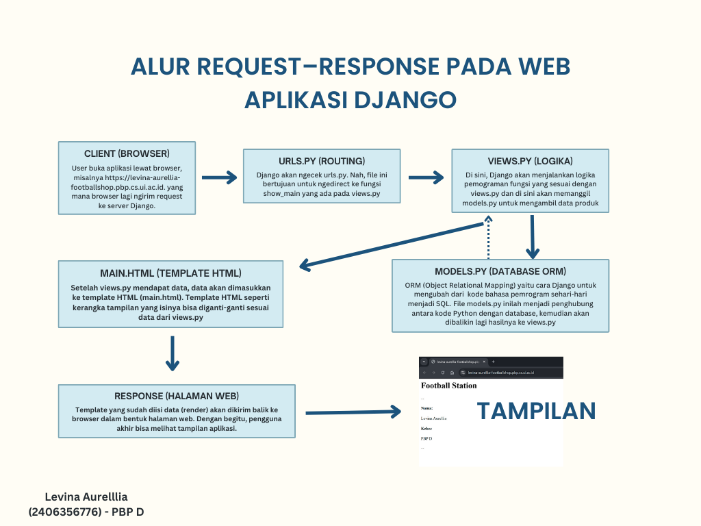

## Link deployment (PWS)
https://levina-aurellia-footballstation.pbp.cs.ui.ac.id

## Deskripsi Football Station
Aplikasi ini adalah tugas PBP (Football Shop) dengan nama aplikasinya yaitu 'Football Station'. Aplikasi ini dibuat menggunakan Django (MVT) dan memenuhi requirement tugas 2 mata kuliah PBP yang antara lain seperti model `Product` memiliki atribut `name`, `price`, `description`, `thumbnail`, `category`, `is_featured` dengan sedikit tambahan atribut sebagai variasi.

## Jawab Pertanyaan
1. Jelaskan bagaimana cara kamu mengimplementasikan checklist di atas secara step-by-step  
[Jawaban]  
Pertama, saya membuat project Django baru dengan perintah django-admin startproject footballstation . di terminal folder football-station, dengan begitu terbentuklah kerangka dasar proyek beserta file manage.py. Setelah itu, saya menambahkan sebuah app bernama main menggunakan python manage.py startapp main, lalu mendaftarkannya ke dalam INSTALLED_APPS di settings.py. Di dalam app main, saya mendesain sebuah model Product yang berisi beberapa field utama seperti name, price, description, thumbnail, category, dan is_featured. Saya juga menambahkan field tambahan stock serta brand dengan choices. Agar perubahan model tersimpan ke database, saya menjalankan python manage.py makemigrations dan python manage.py migrate.  
Selanjutnya, saya membuat fungsi view show_main di views.py yang akan me-render file template main.html. Template ini saya isi dengan informasi sederhana seperti nama aplikasi, nama, dan kelas saya. Routing dilakukan dengan menambahkan path ke urls.py yang ada di dalam main, lalu menghubungkannya dengan urls.py sehingga bisa diakses lewat browser. Setelah itu, saya melakukan testing lokal dengan menjalankan python manage.py runserver. Saat semuanya sudah berjalan baik, saya menyiapkan deployment ke PWS. Untuk itu saya membuat file requirements.txt dengan pip freeze > requirements.txt, memastikan gunicorn sudah termasuk di dalamnya, lalu menambahkan ALLOWED_HOSTS. Saya juga mengubah schema menjadi tugas_individu. Terakhir, saya melakukan git add . lalu git commit, kemudian menjalankan git push pws master dengan credentials PWS yang diberikan. Setelah proses build selesai dan statusnya berubah menjadi Running, aplikasi saya sudah berhasil diakses melalui link PWS.  
  

2. Buatlah bagan yang berisi request client ke web aplikasi berbasis Django beserta responnya dan jelaskan pada bagan tersebut kaitan antara urls.py, views.py, models.py, dan berkas html.  
[Jawaban]  
Berikut adalah bagan yang telah dibuat:   
   
Ringkasan penjelasan tambahan:  
- urls.py untuk menentukan URL mana akan ditangani oleh view mana.
- views.py, berisi fungsi/class yang menangani request, mengambil data dari models, lalu menyiapkan context untuk template.
- models.py untuk mengatur struktur data di database, termasuk query untuk mengambil atau menyimpan data.
- Template HTML,  berisi template tag untuk menampilkan data yang dikirim dari view.
  

3. Jelaskan peran settings.py dalam proyek Django!  
[Jawaban]  
settings.py merupakan pusat konfigurasi proyek Django. Semua pengaturan penting terkait database, template, middleware, security, semuanya dikelola di settings.py ini. Perannya mulai dari BASE_DIR yaitu menyimpan data path dasar proyek. Kemudian, SECRET_KEY untuk keamanan seperti enkripsi token, DEBUG untuk menentukan apakah Django menampilkan pesan error atau tidak. Kemudian, ALLOWED_HOSTS untuk mendaftarkan domain/IP yang boleh mengakses aplikasi. INSTALLED_APPS berisi daftar aplikasi Django custom apps yang aktif, seperti di sini saya menambahkan 'main' ke dalam INSTALLED_APPS. Kemudian, MIDDLEWARE berperan untuk menentukan proses req atau response yang dijalankan Django.   
Dari penjelasan di atas tentang peran masing-masing komponen yang ada pada settings.py, menunjukkan bahwa settings.py tidak hanya berfungsi sebagai kumpulan konfigurasi teknis, tetapi juga sebagai penghubung antarbagian framework Django. Mulai dari keamanan (SECRET_KEY, DEBUG, ALLOWED_HOSTS), aplikasi yang digunakan (INSTALLED_APPS), hingga alur request-response (MIDDLEWARE), semuanya pengaturannya dari file ini. Oleh karena itu, settings.py merupakan pusat yang memastikan setiap komponen dalam proyek Django berjalan sesuai aturan dan kebutuhan yang telah ditentukan.  

4. Bagaimana cara kerja migrasi database di Django?  
[Jawaban]  
Adanya migrasi database pada Django bertujuan untuk menyimpan instruksi segala hal modifikasi skema basis data. Setiap kali terdapat perubahan, menambahkan, atau memodifikasi perlu dipastikan bahwa basis data tersimpan dan sinkron dengan model yang ada pada proyek Django. Maka dari itu, Django menggunakan migrasi inilah untuk tiap kali menerapkan perubahan ke basis data dengan dua perintah, yaitu makemigrations dan migrasi. Berikut cara kerjanya:  
    - Pertama, Django akan memeriksa perubahan pada model dengan membandingkannya terhadap histori migrasi sebelumnya. Setelah itu, Django membuat file migrasi di direktori app/migrations/ berupa file Python yang berisi instruksi perubahan skema database. Nantinya berkas-berkas migrasi akan diberi nomor otomatis sebagai penanda perubahan yang dibuat pada skema basis data.
    - Kedua, setelah file migrasi terbentuk, perintah python manage.py migrate dijalankan untuk menerapkan instruksi tersebut ke database. Django memastikan migrasi dijalankan sesuai urutan yang benar dan menyimpan catatan migrasi yang sudah diterapkan di tabel khusus bernama django_migrations.
    -  Dengan menjalankan perintah tersebut, Django akan melakukan pembaruan pada skema database sehingga selaras dengan modifikasi yang tercatat dalam berkas migrasi.  

  
5. Menurut Anda, dari semua framework yang ada, mengapa framework Django dijadikan permulaan pembelajaran pengembangan perangkat lunak?  
[Jawaban]  
Berdasarkan referensi yang telah saya baca, Django cocok dijadikan pemulaan belajar pengembangan perangkat lunak karena erat kaitannya dengan Python yang banyak orang sudah familiar dengan bahasa pemrograman tersebut, sehingga waktu pengembangan bisa lebih efektif. Selain itu, dokumentasinya lengkap sehingga pemula (seperti saya) mudah mengikuti panduan yang ada. Django juga menggunakan pendekatan 'batteries included' yang artinya menyediakan berbagai fitur penting bawaan seperti ORM sehingga kita tidak perlu membangun semuanya dari nol. Di sisi lain, Django juga memiliki sistem keamanan terintegrasi dan selalu diperbarui, misalnya perlindungan dari XSS, CSRF, dan SQL Injection, tanpa perlu bergantung pada library pihak ketiga yang rentan bug, membuat Django cukup aman dan terpercaya. Framework ini juga fleksibel karena bisa digunakan untuk proyek kecil maupun besar, bahkan hingga level perusahaan seperti Spotify dan Quora, serta mendukung lintas platform dan berbagai basis data. Django juga mengikuti prinsip pemrograman DRY (Don't Repeat Yourself) dan KISS (Keep It Simple and Short) sehingga kode yang dihasilkan lebih rapi, mudah dibaca, dan minim bug. Ditambah lagi, Django memiliki dukungan REST API yang memudahkan pengembang dalam membuat layanan pertukaran data tanpa harus berurusan langsung dengan detail teknis query database. Yang tidak kalah penting, Django juga punya komunitas global yang sangat besar, aktif, dan suportif, sehingga jika ada kesulitan akan mudah menemukan solusi terbaik dari para pengembang berpengalaman. Dengan semua alasan tersebut itulah yang saya rasa mengapa Django dijadikan sebagai framework yang ideal untuk pemula dalam memahami konsep dasar pengembangan perangkat lunak.
  
  
6. Apakah ada feedback untuk asisten dosen tutorial 1 yang telah kamu kerjakan sebelumnya?  
[Jawaban]  
Menurut saya, arahan yang diberikan asdos pada tutorial 1 sangat membantu saya memahami alur pembuatan proyek Django, mulai dari routing hingga bagian-bagian lainnya. Tanpa penjelasan yang asdos sampaikan, baik melalui Discord maupun web tutorial, mungkin saya akan kesulitan menyelesaikan tugas 2 ini. Oleh karena itu, saya rasa tidak ada saran khusus untuk asdos, hanya harapan saya mungkin agar pada sesi lab berikut-berikutnya tetap seperti ini yaitu memberikan penjelasan yang jelas dan lengkap. Terima kasih banyak, kakak asdos!
  
   
Referensi:  
1. https://www.geeksforgeeks.org/python/django-basic-app-model-makemigrations-and-migrate/
2. https://blog.jetbrains.com/pycharm/2023/11/django-vs-flask-which-is-the-best-python-web-framework/
3. https://opensource.com/article/18/8/django-framework
4. https://www.geeksforgeeks.org/blogs/why-django-framework-is-best-for-web-development/
5. https://www.djangoproject.com/start/overview/
